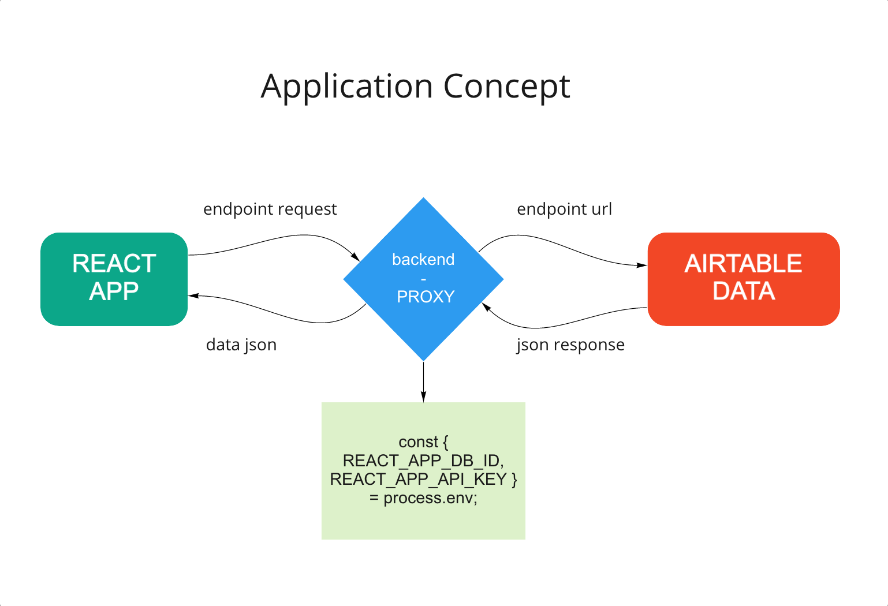

# Demo:

Check demo on Render: [demo](https://email-campaign-react-airtable.onrender.com/) - login password: `admin` (free plan - the first load after a break can take up to a minute)

# Technologies used:

- TypeScript
- React.js: useForm hook, custom hooks, router v6, createContext, useContext
- [Airtable data base](https://airtable.com/) - REST API
- React Query
- Material UI
- Postman: testing endpoints
- Express.js - Proxy (hide api_key, id_base), env variables
- [Email.js](https://www.emailjs.com/)
- Jest, Testing Library, supertest, Playwright
- GitHub Actions CI
- Deploying on Render (free plan, `render.yaml` Blueprint)

# Main goal:

<p align="center" >
 
</p>

Create CRUD application, which allows to use five HTTP methods that can and should respond to RESTful APIs so that the client can perform the four basic CRUD operations: Create, Read, Update and Delete.

Connect app to the Email.js and send personalized email just by one click to all choosen active subscribers.

<br>



<br>
<br>

## Final template email example:

<br>
<br>


<br>
<br>

# General description:

App is devided for two parts: client and server side.

1. **Clinet side -** subscribers and campaigns

a) Subscribers:

- get a list of the subscribers and general data
- get a status list and general data
- get a details of each subscriber
- add a new subscriber in the form

b) Campaigns:

- get a list of campaigns and general data
- get a status list and general data
- get a details of each campaign to edit them
- add a new email campaign

2. **Server side - PROXY**

   The data are downloading from the Airtable - it uses simple token=based authentication "Authorization: Bearer YOUR_API_KEY" - authenticate to the API by providing my API key in the HTTP authorization bearer token header. I didn't want to provide my API key with api_key query parameter because of slightly lower-security approach.

   <br>

      

   <br>
   <br>

   I have used an **express.js** to build a backend proxy server - backend API that will make requests to the Airtable, get back that response and then respond to someone who made that request. In this case sensitive data like key or id_base are hidden and are not available in the response header.

<br>

# Testing:

Also, I have used a tool such as **Postman** to test for valid, invalid, authorised and unauthorised requests, to ensure that the API responds correctly to every endpoint.

<br>


<br>
<br>

Example of API tests:

<br>

<br>
<br>

Results of API tests and automating their execution by Postman's runner:

<br>

<br>
<br>

# ToDo:

I would like to rewrite application and add:

- Styled Components
- Redux Toolkit + Saga

# Running locally:

1. Create `.env` in the project root:

```
REACT_APP_DB_ID=appXXXXXXXXXXXXXX     # Airtable base id
REACT_APP_API_KEY=patXXXXXXXXXXXXXX   # Airtable personal access token
ADMIN_PASSWORD=...                    # password for the login form
AUTH_SECRET=...                       # random string for signing login tokens
```

2. Install and start (two terminals):

```bash
npm install && npm start                       # API on http://localhost:5000
cd client && npm install && npm start          # app on http://localhost:3000
```

On Node 17+ start the client with `NODE_OPTIONS=--openssl-legacy-provider npm start` (react-scripts 4).

# Tests:

| command                                          | what                                                        |
| ------------------------------------------------ | ----------------------------------------------------------- |
| `npm run typecheck`                              | TypeScript (server + client)                                |
| `npm install --prefix server && npm test`        | server unit tests - Jest + supertest, Airtable mocked       |
| `cd client && npm test`                          | client unit tests - Jest + Testing Library                  |
| `npm run build`<br>`npm install --prefix e2e && npm run test:e2e` | Playwright end-to-end tests |

The e2e tests run the production build of the client and the server against a fake Airtable (`e2e/mock-airtable.ts`), so they never touch the real base. On macOS 12 (no Playwright Chromium) use the installed Chrome: `PW_CHANNEL=chrome npm run test:e2e`.

# Git workflow:

`main` = production, `dev` = integration. Every change goes to a feature branch, is merged into `dev`, and gets to `main` through a pull request `dev -> main` after CI (typecheck, unit tests, build, e2e) passes. Render deploys `main` automatically.

- I have used images from the [Email.js](https://www.emailjs.com/) website.
