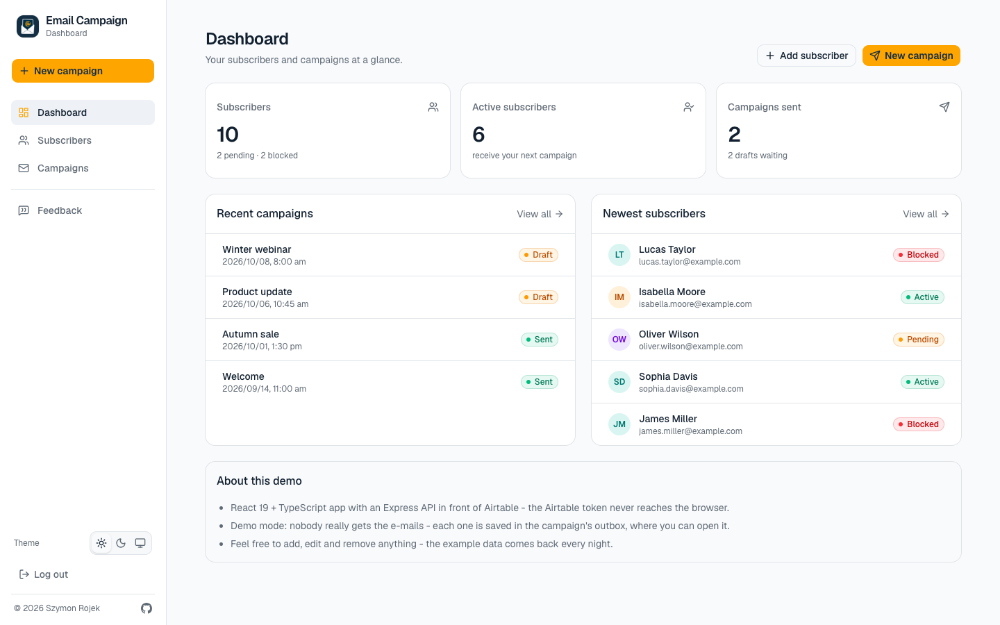
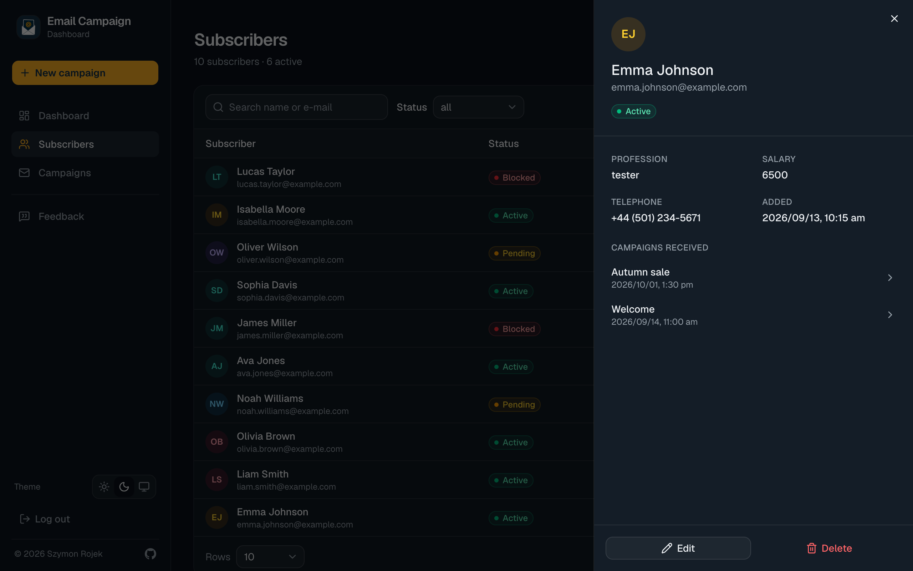
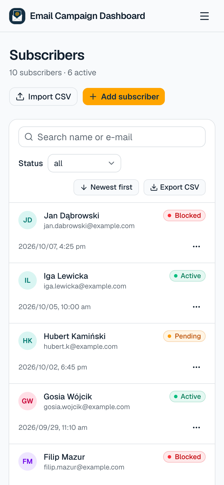
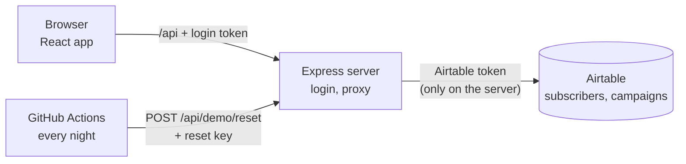
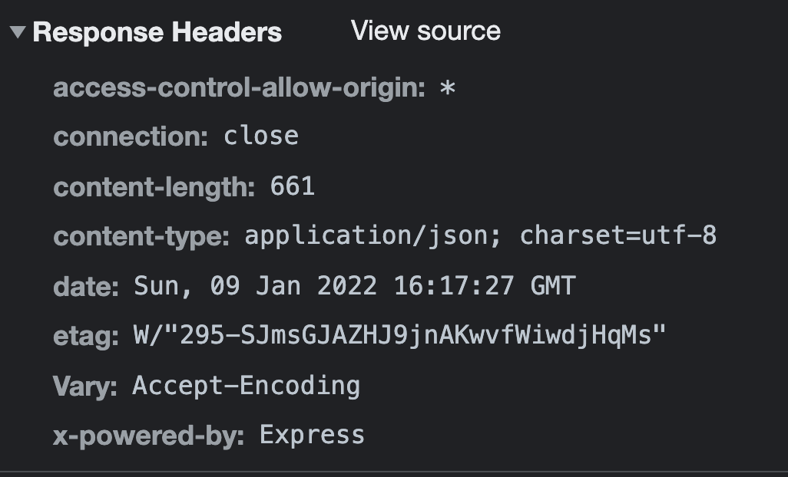
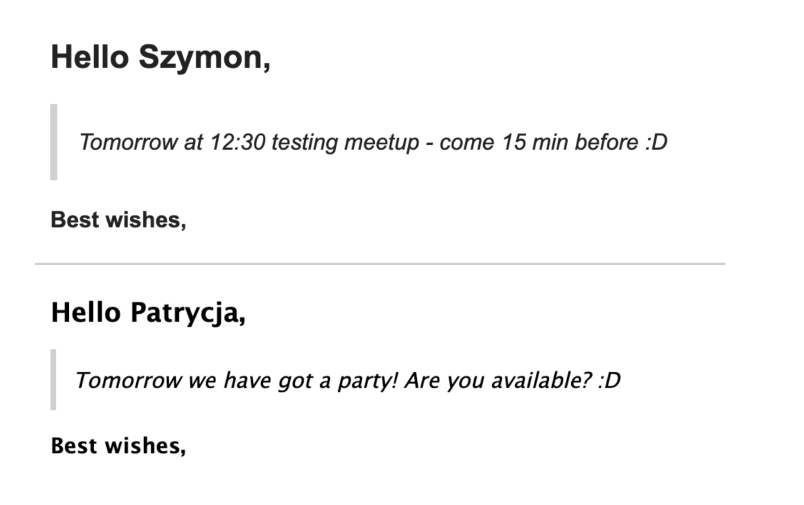
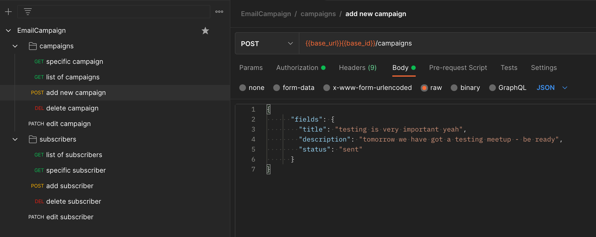
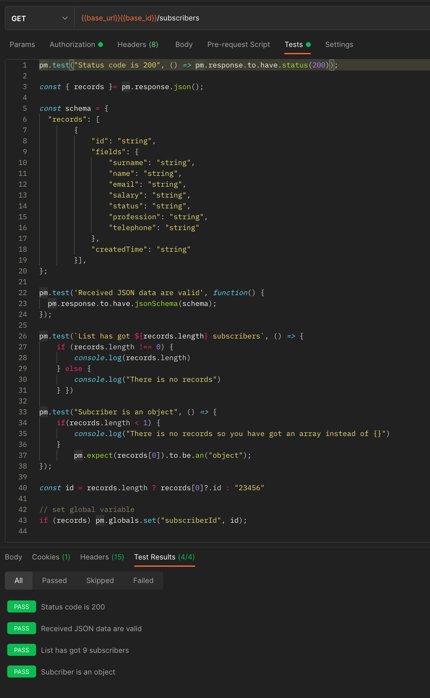
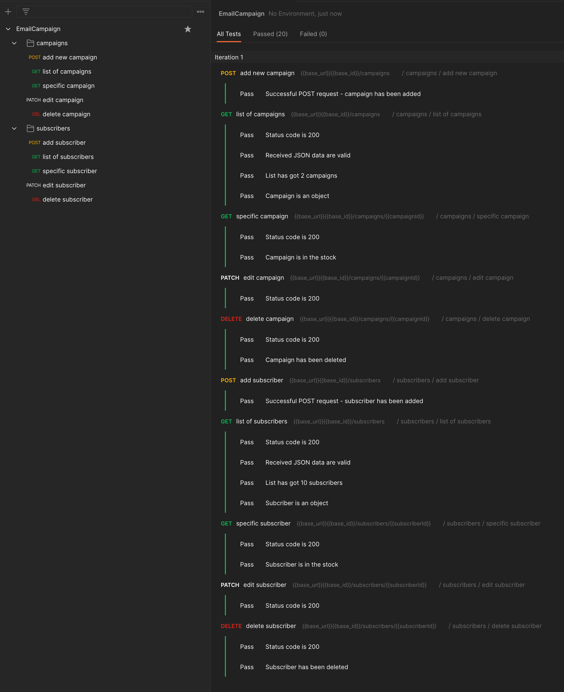

# Email Campaign Dashboard

[](https://github.com/SzymonRojek/email-campaign-dashboard/actions/workflows/ci.yml)

A full-stack web app for running e-mail campaigns: manage subscribers, write campaigns and send them to the chosen active subscribers. Built with **React, TypeScript and Express**, data stored in **Airtable**, covered by **automated tests** and deployed automatically with **CI/CD**.



<table>
  <tr>
    <td width="68%"></td>
    <td></td>
  </tr>
</table>

## Live demo

| | link | login password |
| --- | --- | --- |
| **Production** | [email-campaign-dashboard-app.onrender.com](https://email-campaign-dashboard-app.onrender.com/) | `admin` |
| Staging (newest changes) | [email-campaign-dashboard-staging.onrender.com](https://email-campaign-dashboard-staging.onrender.com/) | `admin` |

> Hosted on a free plan - after a break the first load can take up to a minute.
>
> **Demo mode:** the password is public, so nobody really gets the e-mails (anybody could send e-mails from my account). Sending builds a real, personalized e-mail for every recipient and saves it in the campaign's outbox, where you can open each one.
>
> Feel free to add, edit and remove anything - the example data comes back every night. Please use made-up data, not a real person's e-mail or phone number: the demo is public.

## Features

**Subscribers**
- list with search (name or e-mail, no Polish letters needed), status filter (active / pending / blocked / unsubscribed) and sorting by date
- only the name, the surname and the e-mail are required (profession, salary and phone are optional)
- details, adding and editing in a side panel over the list - the list keeps its search and filter, the panel has a link of its own
- one e-mail = one subscriber (checked in the form and on the server)
- CSV export of what the list shows (a report, with the status); CSV import with a preview that checks every row like the form and imports only the valid ones - the file brings only the person's data, the status (`pending` or `active`, the latter only with a confirmed permission to e-mail them) is chosen once for the whole import, and existing e-mails are never overwritten

**Campaigns**
- write a campaign, save it as a draft or send it - to all active subscribers or only the chosen ones, after a confirmation with the number of recipients
- personalization: `{{name}}` and `{{surname}}` in the title and the message become each recipient's own (buttons insert them; a typo like `{{nmae}}` is pointed out in the form and refused by the server)
- simple formatting: `**bold**`, `*italic*`, an empty line starts a paragraph, links work as they are (up to 500 characters)
- a preview before sending, exactly as the chosen recipient will get it - built by the same server template as the e-mails themselves
- a sent campaign shows who got it, and every e-mail opens exactly as its recipient got it, the way an inbox shows it; the list of recipients exports to CSV (name, e-mail, sent date)
- a subscriber's panel lists the campaigns they got - each one opens the e-mail itself
- every e-mail has an **unsubscribe link** - a public page (no login) with a link that can not be guessed; the subscriber becomes `unsubscribed` and gets no more campaigns
- edit drafts (click the row), duplicate any campaign as a new draft, search, filter, sort

**Everywhere**
- dashboard with the numbers, recent campaigns and newest subscribers
- no lost work: leaving a form with unsaved changes asks first
- light / dark / system theme, works on phones (the lists become cards)
- login required for the app and its data

## Highlights

- **Full-stack TypeScript** - React client and Express server, strict mode
- **Secure backend** - the Airtable token never reaches the browser; login with signed tokens and protection against password guessing
- **Automated testing** - 113 server and 85 client unit tests, 59 end-to-end tests in a real browser (Playwright)
- **CI/CD** - every pull request is checked by GitHub Actions; `dev` deploys to staging and `main` to production automatically
- **Team-style Git workflow** - feature branches, pull requests, staging before production

## Tech stack

| area | technologies |
| --- | --- |
| Frontend | React 19, TypeScript, Vite, Tailwind CSS, shadcn/ui (Radix), React Router 7, TanStack Query, React Hook Form + Yup |
| Backend | Node.js 24, Express, TypeScript, Airtable REST API |
| Testing | Vitest, Jest, React Testing Library, supertest, Playwright |
| DevOps | GitHub Actions, Render (`render.yaml` Blueprint) |

## How it works


```mermaid
flowchart LR
  B["Browser<br/>React app"] -- "/api + login token" --> S["Express server<br/>login, proxy"]
  S -- "Airtable token<br/>(only on the server)" --> A[("Airtable<br/>subscribers, campaigns")]
  G["GitHub Actions<br/>every night"] -- "POST /api/demo/reset<br/>+ reset key" --> S
```

The React app never talks to Airtable directly. The Express server works as a **proxy**: it keeps the Airtable base ID and token in environment variables, calls Airtable and returns only the data - the token is not visible in the browser or in the response headers.

The server also handles the **login**: `POST /api/auth/login` checks the password and returns a signed token valid for 8 hours. All data endpoints require it in the `Authorization: Bearer <token>` header, and after 5 wrong passwords the IP is blocked for 15 minutes.

<details>
<summary>API endpoints</summary>

All endpoints are under `/api`:

| method | endpoint | auth |
| ------ | -------- | ---- |
| `GET` | `/api/health` | - |
| `POST` | `/api/auth/login` | - |
| `GET`, `POST` | `/api/subscribers` | token |
| `POST` | `/api/subscribers/import` | token |
| `GET` | `/api/subscribers/:id/emails` | token |
| `GET`, `PATCH`, `DELETE` | `/api/subscribers/:id` | token |
| `GET`, `POST` | `/api/campaigns` | token |
| `GET`, `PATCH`, `DELETE` | `/api/campaigns/:id` | token |
| `POST` | `/api/campaigns/preview` | token |
| `POST` | `/api/campaigns/:id/send` | token |
| `GET` | `/api/campaigns/:id/emails` | token |
| `GET` | `/api/emails/:id/preview` | token |
| `GET`, `POST` | `/api/unsubscribe/:token` | - (the signed link from the e-mail) |
| `POST` | `/api/demo/reset` | reset key (only production) |

The server sends the Airtable token in the `Authorization: Bearer` header (a personal access token - Airtable retired the old API keys), never as a query parameter:



</details>

<details>
<summary>Sending: the outbox and the unsubscribe link</summary>

`POST /api/campaigns/:id/send` - the server, not the browser, decides who gets the campaign (only active subscribers), builds one e-mail per recipient from a template (the campaign text is escaped, so it can not become HTML) and saves a row for each in the `emails` table - the **outbox**. Only then the campaign becomes `sent`.

Why an outbox and not a real e-mail service: the demo is public, and the free Render plan blocks outgoing SMTP. Where the e-mails go is one setting (`MAIL_TRANSPORT`): `outbox` on the demo, `ethereal` locally - a test SMTP server that catches every e-mail and gives a preview link; a real e-mail API would be one more case.

The unsubscribe link is `/#/unsubscribe/<subscriber id>.<signature>` - signed with the server secret, so it can not be guessed or changed to another subscriber.

</details>

<details>
<summary>Daily reset of the demo data</summary>

The login password is public, so visitors change the data. Every night a scheduled GitHub Action (`.github/workflows/demo-reset.yml`) wakes the server up and calls `POST /api/demo/reset` with a secret key. The server creates the examples from `server/demo/seedData.ts` again (subscribers, campaigns and the outbox of the sent ones) and only then deletes the old records (so an error never leaves an empty table) - the dates of the examples are counted back from the day of the reset, so they never look old.

To save Airtable API calls (the free plan has a monthly limit), the server first compares both tables with the examples and **skips the reset when nobody changed anything** - unless the examples are older than 7 days. The endpoint exists only where `DEMO_RESET_KEY` is set (production), and two resets never run at the same time.

</details>

## Testing

Every pull request runs in GitHub Actions: type checking, lint, unit tests, production build and end-to-end tests.

- **Server unit tests** (Jest + supertest) - login, tokens, protection against password guessing, all endpoints, duplicate e-mails, the CSV import, the demo data reset, the configuration; Airtable is mocked
- **Client unit tests** (Vitest + React Testing Library) - CSV reading / writing, search, sorting and filtering, form validation, API client, login form, choosing recipients, theme
- **End-to-end tests** (Playwright) - real user flows in a browser on the production build: logging in, the subscriber panel (add / edit / activate / delete), search, CSV import and export, drafting, duplicating and sending campaigns (with the confirmation), the "unsaved changes" question, dark mode, loading errors, phones. They run against a fake Airtable (`e2e/mock-airtable.ts`), so they never touch real data.

## Running locally

Needs **Node.js 24** and an Airtable base with the tables `subscribers`, `campaigns` and `emails` (the outbox: `email`, `name`, `subscriberId`, `campaignId`, `sentAt` - single line text).

1. Copy the example settings and fill them in:

   ```bash
   cp .env.example .env
   ```

2. Install and start (two terminals):

   ```bash
   npm install && npm start                       # API on http://localhost:5000
   cd client && npm install && npm start          # app on http://localhost:3000
   ```

### Environment variables

| variable | where | value |
| --- | --- | --- |
| `AIRTABLE_BASE_ID` | `.env`, Render | the Airtable base ID - `app...` from the base's address |
| `AIRTABLE_TOKEN` | `.env`, Render | an Airtable personal access token (`pat....`) with `data.records:read` / `write` for that base |
| `ADMIN_PASSWORD` | `.env`, Render | the password of the login form (`admin` in the demo) |
| `AUTH_SECRET` | `.env`, Render | a random secret that signs the login tokens (Render generates it) |
| `DEMO_RESET_KEY` | Render (production), GitHub secret | the key of the nightly reset - **only on production**, it turns on `POST /api/demo/reset`, which wipes the base |
| `MAIL_TRANSPORT` | `.env` (optional) | `outbox` (default) or `ethereal` - locally also sends to a test SMTP server and logs the preview links |
| `DEMO_APP_URL` | GitHub variable | the production address the nightly reset calls |

Only the server reads these - none of them ends up in the browser. When an Airtable variable is missing, the server says so in its log at start.

### Running the tests

| command | what |
| --- | --- |
| `npm run typecheck` | TypeScript (server + client) |
| `npm install --prefix server && npm test` | server unit tests |
| `cd client && npm test` | client unit tests |
| `npm run build`<br>`npm install --prefix e2e && npm run test:e2e` | end-to-end tests (need the production build) |

On macOS 12 (no Playwright Chromium) run the e2e tests on the installed Chrome: `PW_CHANNEL=chrome npm run test:e2e`.

## Git workflow and deployment

| branch | environment on Render |
| ------ | --------------------- |
| `main` | production - [demo](https://email-campaign-dashboard-app.onrender.com/) |
| `dev`  | staging - [staging demo](https://email-campaign-dashboard-staging.onrender.com/) |

1. Every change starts on a short-lived branch off `dev` (`feature/...`, `fix/...`, `chore/...`).
2. Pull request into `dev` - CI runs and the PR must have no conflicts. A human reviews and **squash-merges** it; Render deploys it to staging.
3. After checking staging - pull request `dev -> main`, CI again, a human merges it with a **merge commit** (not squash, so `dev` and `main` do not drift apart); Render deploys production.

**Hotfix** - only for an urgent fix of production:

1. Branch `hotfix/...` off `main`.
2. Pull request into `main` - CI runs, a human merges it; Render deploys production.
3. Right after that, pull request `main -> dev` (merge commit) - otherwise staging would run a different version than production and new work on `dev` could conflict with the fix.

Both services are defined in `render.yaml` (free plan).

## History

The project started in 2021 as a CRUD app (Create, Read, Update, Delete over a REST API) connected to [EmailJS](https://www.emailjs.com/), which sent a personalized e-mail with one click to all chosen active subscribers. Since the demo became public, nobody really gets the e-mails - they go to the app's outbox, where each one can be opened.

<details>
<summary>The e-mails sent with EmailJS</summary>



</details>

<details>
<summary>API tests in Postman (before the automated tests)</summary>

I have used **Postman** to test valid, invalid, authorised and unauthorised requests. The screenshots show the old endpoints - today they live under `/api/...` and need a token from `/api/auth/login`.



Example of API tests:



Results of the API tests run automatically by Postman's runner:



</details>

## Credits

- The e-mail template images come from the [EmailJS](https://www.emailjs.com/) website.
