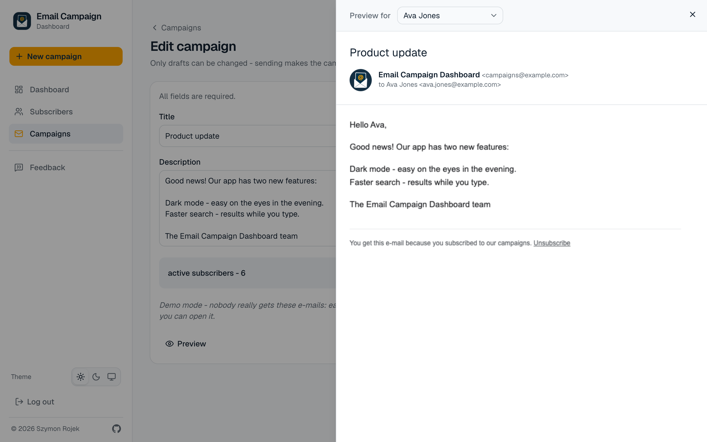
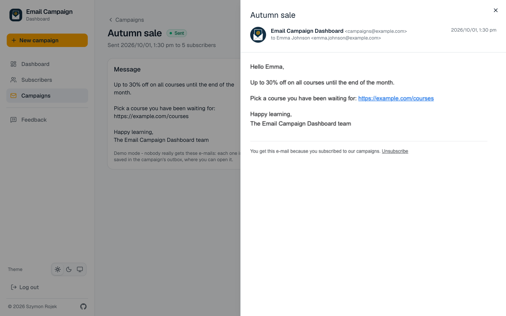
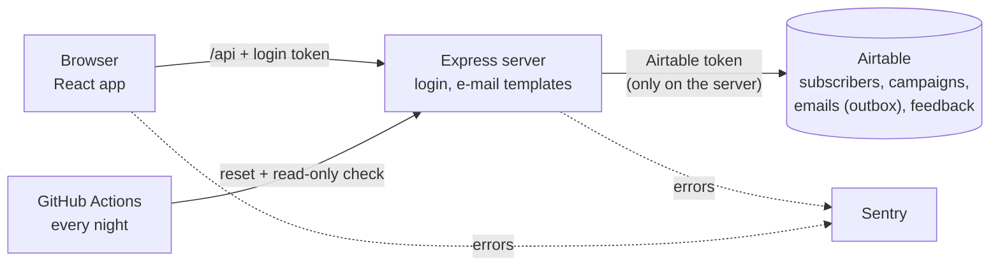

<div align="center">

# Email Campaign Dashboard

**A full-stack app for running e-mail campaigns - subscribers, personalized campaigns, a preview before sending and an outbox of every e-mail sent.**

[](https://github.com/SzymonRojek/email-campaign-dashboard/actions/workflows/ci.yml)
[](https://email-campaign-dashboard-app.onrender.com/)
[](#testing-and-quality)
[](postman/)


[**Live demo**](https://email-campaign-dashboard-app.onrender.com/) · password `admin`

</div>

<table>
  <tr>
    <td width="39%"><br><sub><b>Dashboard</b> - the numbers, recent campaigns, newest subscribers</sub></td>
    <td width="39%"><br><sub><b>Preview before sending</b> - exactly as the chosen recipient gets it</sub></td>
    <td width="22%" rowspan="2"><br><sub><b>On a phone</b> - lists become cards</sub></td>
  </tr>
  <tr>
    <td><br><sub><b>Outbox</b> - every sent e-mail, shown like an inbox</sub></td>
    <td><br><sub><b>Subscriber panel</b> - details and campaigns received, dark mode</sub></td>
  </tr>
</table>

## Contents

- [Live demo](#live-demo)
- [Highlights](#highlights)
- [Features](#features)
- [Tech stack](#tech-stack)
- [Architecture](#architecture)
- [Testing and quality](#testing-and-quality)
- [Running locally](#running-locally)
- [Project structure](#project-structure)
- [Git workflow and deployment](#git-workflow-and-deployment)

## Live demo

| environment | link | password |
| --- | --- | --- |
| **Production** | [email-campaign-dashboard-app.onrender.com](https://email-campaign-dashboard-app.onrender.com/) | `admin` |
| Staging (newest changes) | [email-campaign-dashboard-staging.onrender.com](https://email-campaign-dashboard-staging.onrender.com/) | `admin` |

> [!NOTE]
> **Demo mode** - nobody really gets the e-mails. Sending builds a real, personalized e-mail for every recipient and saves it in the campaign's outbox, where each one can be opened. Feel free to change anything: the example data comes back every night. Please use made-up data - the demo is public.
>
> Free hosting: after a break, the first load can take up to a minute.

> [!TIP]
> **Reviewing the project?** I would love your feedback - use "Leave feedback" on the login page or in the app.

## Highlights

- **Full-stack TypeScript** - React client and Express server, strict mode on both sides
- **Secure by design** - the Airtable token never reaches the browser; signed login tokens, protection against password guessing, signed unsubscribe links, user text always escaped in the e-mails
- **Tested on every level** - 137 server and 95 client unit tests, 63 end-to-end tests in a real browser, a Postman collection of API tests and a Lighthouse audit - all in CI on every pull request
- **Production-ready** - staging and production with automatic deploys, error monitoring (Sentry) without personal data, a nightly demo reset followed by a read-only check of the live app
- **Product thinking** - a preview before every send, no lost work, minimal noise in the UI, accessible (Lighthouse accessibility 100), works on phones

## Features

<table>
  <tr>
    <th align="left" width="33%">Subscribers</th>
    <th align="left" width="33%">Campaigns</th>
    <th align="left" width="34%">Everywhere</th>
  </tr>
  <tr valign="top">
    <td>
      <ul>
        <li>search (also without accents), status filter, sorting</li>
        <li>details, adding and editing in a side panel over the list</li>
        <li>each subscriber's panel lists the campaigns they got</li>
        <li>one e-mail address = one subscriber, checked on both sides</li>
        <li>CSV import with a preview that validates every row; CSV export</li>
      </ul>
    </td>
    <td>
      <ul>
        <li>drafts, sending to all active subscribers or the chosen ones</li>
        <li><code>{{name}}</code> / <code>{{surname}}</code> personalization; a mistyped placeholder is caught</li>
        <li>preview before sending, for any recipient</li>
        <li>outbox: who got it, every e-mail as it was sent; CSV export</li>
        <li>an unsubscribe link in every e-mail (a public page)</li>
      </ul>
    </td>
    <td>
      <ul>
        <li>dashboard with the key numbers</li>
        <li>feedback from reviewers, shown after approval</li>
        <li>unsaved changes are never lost without asking</li>
        <li>light / dark / system theme</li>
        <li>phones: the lists become cards</li>
      </ul>
    </td>
  </tr>
</table>

## Tech stack

| area | technologies |
| --- | --- |
| **Frontend** | React 19, TypeScript, Vite, Tailwind CSS, shadcn/ui (Radix), React Router 7, TanStack Query, React Hook Form + Yup |
| **Backend** | Node.js 24, Express, TypeScript, Airtable REST API |
| **Testing** | Jest + supertest, Vitest + React Testing Library, Playwright, Postman + Newman, Lighthouse |
| **DevOps** | GitHub Actions, Render (`render.yaml` Blueprint), Sentry |

## Architecture


```mermaid
flowchart LR
  B["Browser<br/>React app"] -- "/api + login token" --> S["Express server<br/>login, e-mail templates"]
  S -- "Airtable token<br/>(only on the server)" --> A[("Airtable<br/>subscribers, campaigns,<br/>emails (outbox), feedback")]
  S -. errors .-> M["Sentry"]
  B -. errors .-> M
  G["GitHub Actions<br/>every night"] -- "reset + read-only check" --> S
```

- **The server is the only way to the data.** The React app never talks to Airtable; the Express server keeps the token in environment variables and returns only the data.
- **Login** - `POST /api/auth/login` returns a signed token valid for 8 hours, required by every data endpoint. After 5 wrong passwords the visitor's address (the real one, behind Cloudflare) is blocked for 15 minutes.
- **Sending** - the server, not the browser, decides who gets a campaign (active subscribers only), builds one e-mail per recipient from a template (fills in the name, escapes the text, adds a signed unsubscribe link) and saves it in the outbox. The preview uses the same template.
- **Why an outbox** - the demo is public and the free hosting blocks outgoing SMTP. Where the e-mails go is one setting (`MAIL_TRANSPORT`): `outbox` on the demo, `ethereal` locally (a test SMTP server). A real e-mail service would be one more case.
- **Feedback** - public endpoints with a bot trap and a limit of 3 entries an hour per visitor; a new entry is never shown before it is approved in Airtable.
- **Error monitoring** - Sentry on both sides, only where `SENTRY_DSN` is set; no IP addresses, headers, bodies or clicks, and the unsubscribe token is removed from every address.

<details>
<summary><b>API endpoints</b></summary>

| method | endpoint | auth |
| ------ | -------- | ---- |
| `GET` | `/api/health` | - |
| `POST` | `/api/auth/login` | - |
| `GET`, `POST` | `/api/subscribers` | token |
| `POST` | `/api/subscribers/import` | token |
| `GET`, `PATCH`, `DELETE` | `/api/subscribers/:id` | token |
| `GET` | `/api/subscribers/:id/emails` | token |
| `GET`, `POST` | `/api/campaigns` | token |
| `POST` | `/api/campaigns/preview` | token |
| `GET`, `PATCH`, `DELETE` | `/api/campaigns/:id` | token |
| `POST` | `/api/campaigns/:id/send` | token |
| `GET` | `/api/campaigns/:id/emails` | token |
| `GET` | `/api/emails` | token |
| `GET` | `/api/emails/:id/preview` | token |
| `GET`, `POST` | `/api/unsubscribe/:token` | the signed link from the e-mail |
| `GET`, `POST` | `/api/feedback` | - (public; only approved feedback is listed) |
| `POST` | `/api/demo/reset` | reset key (production only) |

</details>

<details>
<summary><b>Nightly reset of the demo data</b></summary>

The password is public, so visitors change the data. Every night a scheduled GitHub Action calls `POST /api/demo/reset` with a secret key. The server creates the examples from `server/demo/seedData.ts` (with dates counted back from today) and only then deletes the old records, so an error never leaves an empty table. The reset is skipped when nobody changed anything (unless the examples are older than 7 days), and the reviewers' feedback is never touched.

Right after the reset, the read-only "Smoke" folder of the Postman collection checks the live app - a broken demo fails the run and GitHub sends an e-mail.

</details>

## Testing and quality

Every pull request runs all of it in GitHub Actions: type checking, lint, unit tests, the production build, end-to-end tests, API tests and a Lighthouse audit.

| layer | tools | what | scale |
| --- | --- | --- | --- |
| **Server unit** | Jest, supertest | every endpoint, login and limits, sending and templates, unsubscribe links, CSV import, feedback, demo reset, monitoring privacy | 137 tests |
| **Client unit** | Vitest, React Testing Library | validation, CSV, search / sort / filter, API client, login token storage, recipients, theme | 95 tests |
| **End-to-end** | Playwright | real user flows in a browser on the production build: subscribers, campaigns from draft to outbox, unsubscribing, feedback, unsaved changes, dark mode, phones | 63 tests |
| **API** | Postman, Newman | the collection in [`postman/`](postman/): login and refusals (401, 400), duplicate e-mail (409), draft → preview → send → second send (409) → outbox, feedback, clean-up | 30 requests, 56 assertions |
| **Lighthouse** | Lighthouse | 7 screens, logged out and in, desktop and phone; accessibility, best practices and SEO must stay at 100 | every PR |
| **Live demo** | Newman | read-only check of production after the nightly reset | every night |

The end-to-end, API and Lighthouse runs use a fake Airtable (`e2e/mock-airtable.ts`), so they never touch real data. On the live demo, the Postman collection skips every request that would change data.

**Use the collection in Postman:** import `postman/email-campaign-dashboard.postman_collection.json` and an environment from [`postman/`](postman/) - `Local` (fill in your password) or `Demo (read-only)`.

## Running locally

Needs **Node.js 24** and an Airtable base with four tables (all fields text, except where noted):

| table | fields |
| --- | --- |
| `subscribers` | `name`, `surname`, `email`, `status` (single select), `profession`, `salary`, `telephone`, `date` |
| `campaigns` | `title`, `description` (long text), `status` (single select), `date` |
| `emails` | `email`, `name`, `subscriberId`, `campaignId`, `sentAt` |
| `feedback` | `name`, `role`, `message` (long text), `approved` (checkbox), `date` |

```bash
cp .env.example .env                          # fill in the values below
npm install && npm start                      # API on http://localhost:5000
cd client && npm install && npm start         # app on http://localhost:3000
```

<details>
<summary><b>Environment variables</b></summary>

| variable | where | value |
| --- | --- | --- |
| `AIRTABLE_BASE_ID` | `.env`, Render | the Airtable base ID (`app...`) |
| `AIRTABLE_TOKEN` | `.env`, Render | an Airtable personal access token with `data.records:read` / `write` for that base |
| `ADMIN_PASSWORD` | `.env`, Render | the login password |
| `AUTH_SECRET` | `.env`, Render | a random secret that signs the login tokens |
| `MAIL_TRANSPORT` | `.env` (optional) | `outbox` (default) or `ethereal` |
| `SENTRY_DSN` | Render (optional) | the Sentry project's DSN - turns on error monitoring (the client reads it at build time) |
| `SENTRY_ENVIRONMENT` | Render | `production` or `staging` - set in `render.yaml` |
| `DEMO_RESET_KEY` | Render (production), GitHub secret | turns on the nightly reset - **production only**, it wipes the base |
| `DEMO_APP_URL` | GitHub variable | the address the nightly reset calls |

Only the server reads these - none of them reaches the browser (the Sentry DSN is public by design: it can only send errors).

</details>

<details>
<summary><b>Running the tests</b></summary>

| command | what |
| --- | --- |
| `npm run typecheck` | TypeScript (server + client) |
| `npm install --prefix server && npm test` | server unit tests |
| `cd client && npm test` | client unit tests |
| `npm run build && npm install --prefix e2e && npm run test:e2e` | end-to-end tests (on the production build) |
| `npm run build:server && npm run test:api` | API tests (Postman collection, Newman) |
| `npm run build && npm run test:lighthouse` | Lighthouse audit (needs Google Chrome) |

</details>

## Project structure

```text
client/          React app (Vite) - pages, components, hooks, shadcn/ui
server/          Express API - routes, controllers, e-mail templates, demo data, Sentry
e2e/             Playwright tests, the fake Airtable, the API test and Lighthouse runners
postman/         Postman collection and environments
docs/            README screenshots
.github/         CI and the nightly demo reset
render.yaml      production and staging on Render
```

## Git workflow and deployment

| branch | environment |
| ------ | ----------- |
| `main` | production |
| `dev`  | staging |

1. Every change starts on a short-lived branch off `dev` (`feature/...`, `fix/...`, `chore/...`).
2. Pull request into `dev` - CI must pass and there must be no conflicts, then a review and a merge; Render deploys staging.
3. After checking staging - a release pull request `dev -> main`, merged with a merge commit; Render deploys production.

**Hotfix:** a `hotfix/...` branch off `main`, a pull request into `main`, then right away `main -> dev`, so both environments run the same code.

## History

The project started in 2021 as a CRUD app that sent e-mails through EmailJS straight from the browser. In 2026 it was rebuilt step by step into its current form: TypeScript on both sides, a secure server, a new UI, automated tests on every level and CI/CD.

---

<div align="center">
<sub>Built by <a href="https://github.com/SzymonRojek">Szymon Rojek</a></sub>
</div>
