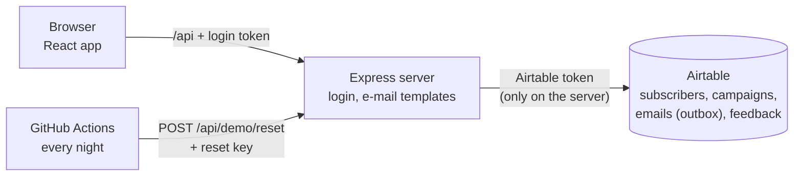

# Email Campaign Dashboard

[](https://github.com/SzymonRojek/email-campaign-dashboard/actions/workflows/ci.yml)

A full-stack web app for running e-mail campaigns: manage subscribers, write personalized campaigns, preview them and send them to the chosen subscribers. Built with **React, TypeScript and Express**, data stored in **Airtable**, covered by **automated tests** and deployed with **CI/CD**.


<table>
  <tr>
    <td width="68%"></td>
    <td></td>
  </tr>
</table>

## Live demo

| | link | password |
| --- | --- | --- |
| **Production** | [email-campaign-dashboard-app.onrender.com](https://email-campaign-dashboard-app.onrender.com/) | `admin` |
| Staging (newest changes) | [email-campaign-dashboard-staging.onrender.com](https://email-campaign-dashboard-staging.onrender.com/) | `admin` |

> Free hosting - after a break the first load can take up to a minute.
>
> **Demo mode:** nobody really gets the e-mails. Sending builds a real, personalized e-mail for every recipient and saves it in the campaign's outbox, where each one can be opened. Feel free to change anything - the example data comes back every night. Please use made-up data: the demo is public.

## Highlights

- **Full-stack TypeScript** - React client and Express server, strict mode
- **Secure backend** - the Airtable token never reaches the browser; login with signed tokens, protection against password guessing, signed unsubscribe links, user text always escaped in the e-mails
- **Automated testing** - 130 server and 87 client unit tests, 63 end-to-end tests in a real browser (Playwright)
- **CI/CD** - every pull request is checked by GitHub Actions; `dev` deploys to staging and `main` to production automatically
- **Team-style Git workflow** - feature branches, pull requests, staging before production
- **Product thinking** - minimal UI feedback, no lost work, accessible components, works on phones

## Features

**Subscribers**
- search (also without accents), status filter (active / pending / blocked / unsubscribed), sorting
- details, adding and editing in a side panel over the list; each subscriber's panel lists the campaigns they got
- one e-mail address = one subscriber, checked in the form and on the server
- CSV export of the list; CSV import with a preview that validates every row and imports only the valid ones

**Campaigns**
- write a campaign, save it as a draft or send it to all active subscribers or only the chosen ones
- personalization with `{{name}}` and `{{surname}}` in the title and the message; a mistyped placeholder is caught before sending
- preview before sending - exactly as the chosen recipient will get it
- a sent campaign shows its recipients and opens each e-mail the way an inbox shows it
- CSV export of the recipients of one campaign, or of all e-mails of the campaigns shown in the list
- every e-mail has an **unsubscribe link** to a public page; the subscriber then gets no more campaigns
- duplicate any campaign as a new draft

**Feedback from reviewers**
- anybody can leave feedback - also on the login page, without logging in
- shown only after the owner approves it in Airtable and only if its author agreed; the login page shows the newest three, the Feedback page all of them
- protected against bots and floods (a hidden field, 3 entries an hour per address); kept in memory on the server for 30 seconds, so many visits at once do not use up the Airtable API limit

**Everywhere**
- dashboard with the key numbers, recent campaigns and newest subscribers
- leaving a form with unsaved changes asks first
- light / dark / system theme; on phones the lists become cards

## Tech stack

| area | technologies |
| --- | --- |
| Frontend | React 19, TypeScript, Vite, Tailwind CSS, shadcn/ui (Radix), React Router 7, TanStack Query, React Hook Form + Yup |
| Backend | Node.js 24, Express, TypeScript, Airtable REST API |
| Testing | Vitest, Jest, React Testing Library, supertest, Playwright |
| DevOps | GitHub Actions, Render (`render.yaml` Blueprint) |

## How it works


```mermaid
flowchart LR
  B["Browser<br/>React app"] -- "/api + login token" --> S["Express server<br/>login, e-mail templates"]
  S -- "Airtable token<br/>(only on the server)" --> A[("Airtable<br/>subscribers, campaigns,<br/>emails (outbox), feedback")]
  G["GitHub Actions<br/>every night"] -- "POST /api/demo/reset<br/>+ reset key" --> S
```

The React app never talks to Airtable directly. The Express server keeps the Airtable token in environment variables, calls Airtable and returns only the data.

**Login:** `POST /api/auth/login` checks the password and returns a signed token valid for 8 hours. Every data endpoint requires it in the `Authorization: Bearer <token>` header; after 5 wrong passwords the IP is blocked for 15 minutes.

**Sending:** the server, not the browser, decides who gets a campaign (active subscribers only). It builds one e-mail per recipient from a template - fills in the name, escapes the text so it can not become HTML, adds a signed unsubscribe link - and saves it in the `emails` table (the outbox). The preview before sending uses the same template.

**Why an outbox:** the demo is public and the free hosting blocks outgoing SMTP. Where the e-mails go is one setting (`MAIL_TRANSPORT`): `outbox` on the demo, `ethereal` locally (a test SMTP server that catches every e-mail). A real e-mail service would be one more case.

<details>
<summary>API endpoints</summary>

| method | endpoint | auth |
| ------ | -------- | ---- |
| `GET` | `/api/health` | - |
| `POST` | `/api/auth/login` | - |
| `GET`, `POST` | `/api/subscribers` | token |
| `POST` | `/api/subscribers/import` | token |
| `GET`, `PATCH`, `DELETE` | `/api/subscribers/:id` | token |
| `GET` | `/api/subscribers/:id/emails` | token |
| `GET`, `POST` | `/api/campaigns` | token |
| `POST` | `/api/campaigns/preview` | token |
| `GET`, `PATCH`, `DELETE` | `/api/campaigns/:id` | token |
| `POST` | `/api/campaigns/:id/send` | token |
| `GET` | `/api/campaigns/:id/emails` | token |
| `GET` | `/api/emails` | token |
| `GET` | `/api/emails/:id/preview` | token |
| `GET`, `POST` | `/api/unsubscribe/:token` | the signed link from the e-mail |
| `GET`, `POST` | `/api/feedback` | - (public; only approved feedback is listed) |
| `POST` | `/api/demo/reset` | reset key (production only) |

</details>

<details>
<summary>Nightly reset of the demo data</summary>

The password is public, so visitors change the data. Every night a scheduled GitHub Action (`.github/workflows/demo-reset.yml`) calls `POST /api/demo/reset` with a secret key. The server creates the examples from `server/demo/seedData.ts` (with dates counted back from today) and only then deletes the old records, so an error never leaves an empty table.

To save Airtable API calls, the reset is **skipped when nobody changed anything** - unless the examples are older than 7 days. The endpoint exists only where `DEMO_RESET_KEY` is set (production). The reviewers' feedback is never reset.

</details>

## Testing

Every pull request runs in GitHub Actions: type checking, lint, unit tests, production build and end-to-end tests.

- **Server** (Jest + supertest) - login and tokens, every endpoint, sending and the outbox, templates and escaping, unsubscribe links, the CSV import, the demo reset; Airtable is mocked
- **Client** (Vitest + React Testing Library) - CSV reading and writing, search, sorting and filtering, form validation, the API client, choosing recipients, theme
- **End-to-end** (Playwright) - real user flows on the production build: login, the subscriber panel, search, CSV import and export, drafting, previewing, sending and duplicating campaigns, opening sent e-mails, unsubscribing, leaving feedback, unsaved changes, dark mode, loading errors, phones. They run against a fake Airtable (`e2e/mock-airtable.ts`), so they never touch real data.

## Running locally

Needs **Node.js 24** and an Airtable base with four tables (all fields text, except where noted):

| table | fields |
| --- | --- |
| `subscribers` | `name`, `surname`, `email`, `status` (single select), `profession`, `salary`, `telephone`, `date` |
| `campaigns` | `title`, `description` (long text), `status` (single select), `date` |
| `emails` | `email`, `name`, `subscriberId`, `campaignId`, `sentAt` |
| `feedback` | `name`, `role`, `message` (long text), `isPublic` (checkbox), `approved` (checkbox), `date` |

```bash
cp .env.example .env                          # fill in the values below
npm install && npm start                      # API on http://localhost:5000
cd client && npm install && npm start         # app on http://localhost:3000
```

| variable | where | value |
| --- | --- | --- |
| `AIRTABLE_BASE_ID` | `.env`, Render | the Airtable base ID (`app...`) |
| `AIRTABLE_TOKEN` | `.env`, Render | an Airtable personal access token with `data.records:read` / `write` for that base |
| `ADMIN_PASSWORD` | `.env`, Render | the login password |
| `AUTH_SECRET` | `.env`, Render | a random secret that signs the login tokens |
| `MAIL_TRANSPORT` | `.env` (optional) | `outbox` (default) or `ethereal` |
| `DEMO_RESET_KEY` | Render (production), GitHub secret | turns on the nightly reset - **production only**, it wipes the base |
| `DEMO_APP_URL` | GitHub variable | the address the nightly reset calls |

Only the server reads these - none of them reaches the browser.

| command | what |
| --- | --- |
| `npm run typecheck` | TypeScript (server + client) |
| `npm install --prefix server && npm test` | server unit tests |
| `cd client && npm test` | client unit tests |
| `npm run build && npm install --prefix e2e && npm run test:e2e` | end-to-end tests (on the production build) |

## Git workflow and deployment

| branch | environment |
| ------ | ----------- |
| `main` | production |
| `dev`  | staging |

1. Every change starts on a short-lived branch off `dev` (`feature/...`, `fix/...`, `chore/...`).
2. Pull request into `dev` - CI must pass, then a review and a **squash merge**; Render deploys staging.
3. After checking staging - pull request `dev -> main` merged with a **merge commit**; Render deploys production.

**Hotfix:** a `hotfix/...` branch off `main`, pull request into `main`, then right away `main -> dev`, so both environments run the same code.

## History

The project started in 2021 as a CRUD app that sent e-mails through EmailJS straight from the browser. In 2026 it was rebuilt step by step into its current form: TypeScript on both sides, a secure server, a new UI, automated tests and CI/CD.
