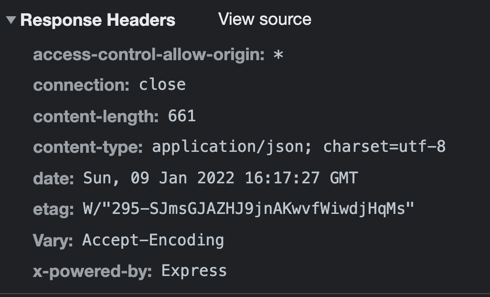
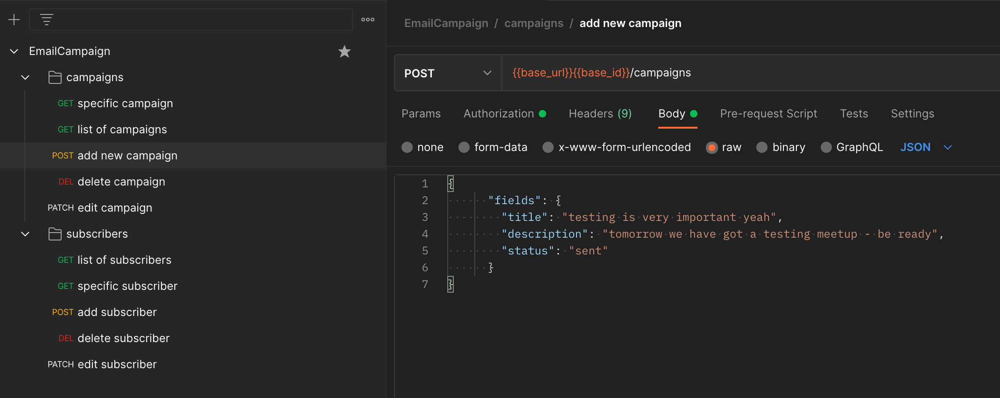

# App still in progress

Actually I am working on:

- general layout
- connect the app to Email.js external resource
- possibly I will add login component (password confirmation and connect app to the local session when application is running in the browser)
- scubsribers details (working on layouts of the tables)

Check demo on Herokuapp: [demo](https://email-campaign-subscribers.herokuapp.com/)

## Technologies used:

- React.js: useForm hook, custom hooks, router v6 etc.
- Material UI
- [Airtable data base](https://airtable.com/)
- REST API
- Postman
- Express.js - Proxy (hide api_key, id_base), env variables
- [Email.js](https://www.emailjs.com/)
- Heroku

# General description

## Main goal

Personalized email - by one click send same email content to the all of active subscribers.

 
 

 
 

App is devided for two parts: client and server side.

1. **Clinet side -** subscribers and campaigns

a) Subscribers:

- get a list of the subscribers and general data in the table
- get a status list and general data in the table
- get a details of each subscriber and detailed data in the table
- add a new subscriber in the form

b) Campaigns:

- get a list of campaigns and general data in the table
- get a status list and general data in the table
- get a details of each campaign to edit in the form
- add a new email campaign in the form

2. **Server side:**

   The data are downloading from the Airtable - it uses simple token=based authentication "Authorization: Bearer YOUR_API_KEY" - authenticate to the API by providing my API key in the HTTP authorization bearer token header. I didn't want to provide my API key with api_key query parameter because of slightly lower-security approach.

    

      

    
    

   I have used an **express.js** to build a backend proxy server - backend API that will make requests to the Airtable, get back that response and then respond to someone who made that request. In this case sensitive data like key or id_base are hidden and are not available in the response header.

Also, I have used a tool such as **Postman** to test for valid, invalid, authorised and unauthorised requests, to ensure that the API responds correctly to every endpoint.

 

 
 

# Available Scripts:

In the project directory, you can run:

- clinet-side

### `npm start`

- server-side

### `npm start`

Runs the app in the development mode.\
Open [http://localhost:3000](http://localhost:3000) to view it in the browser.

The page will reload if you make edits.\
You will also see any lint errors in the console.

### `npm test`

Launches the test runner in the interactive watch mode.\
See the section about [running tests](https://facebook.github.io/create-react-app/docs/running-tests) for more information.

### `npm run build`

Builds the app for production to the `build` folder.\
It correctly bundles React in production mode and optimizes the build for the best performance.

The build is minified and the filenames include the hashes.\
Your app is ready to be deployed!

See the section about [deployment](https://facebook.github.io/create-react-app/docs/deployment) for more information.

### `npm run eject`

**Note: this is a one-way operation. Once you `eject`, you can’t go back!**

If you aren’t satisfied with the build tool and configuration choices, you can `eject` at any time. This command will remove the single build dependency from your project.

Instead, it will copy all the configuration files and the transitive dependencies (webpack, Babel, ESLint, etc) right into your project so you have full control over them. All of the commands except `eject` will still work, but they will point to the copied scripts so you can tweak them. At this point you’re on your own.

You don’t have to ever use `eject`. The curated feature set is suitable for small and middle deployments, and you shouldn’t feel obligated to use this feature. However we understand that this tool wouldn’t be useful if you couldn’t customize it when you are ready for it.

This project was bootstrapped with [Create React App](https://github.com/facebook/create-react-app).

- I have used images from the [Email.js](https://www.emailjs.com/) website.
